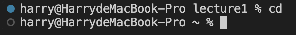

# Lab Report 1

*Author: Yuxiang Hong*

Command Examples for `cd`:

* Share an example of using the command with no arguments.

  The **absolute path** is `/Users/harry`

  In order to get this output, I run `pwd` to print working directory. Since I using `cd` without argument, it directs me to my home directory.

  The output is not an error.

* Share an example of using the command with a path to a directory as an argument.

* Share an example of using the command with a path to a file as an argument.

Command Examples for `ls`:

* Share an example of using the command with no arguments.

* Share an example of using the command with a path to a directory as an argument.

* Share an example of using the command with a path to a file as an argument.

Command Examples for `cat`:

* Share an example of using the command with no arguments.

  

* Share an example of using the command with a path to a directory as an argument.

  

* Share an example of using the command with a path to a file as an argument.

  
