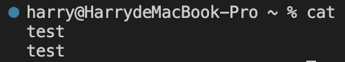

# Lab Report 1

*Author: Yuxiang Hong*

Command Examples for `cd`:

* Share an example of using the command with no arguments.

  The **absolute path** is `/Users/harry`

  If I used `cd` without argument, the system changed the current working directory to my home directory.

  The output is not an error.

* Share an example of using the command with a path to a directory as an argument.

  The **absolute path** is `/Users/harry`

  The system changed the current working directory to the argument directory.

  The output is not an error.

* Share an example of using the command with a path to a file as an argument.

  The **absolute path** is `/Users/harry/lecture1`

  I got this output since I didn't give a directory argument.

  The output is an error since the `cd` command expects a directory as the argument instead of a file.

Command Examples for `ls`:

* Share an example of using the command with no arguments.

  The **absolute path** is `/Users/harry`

  The system listed the contents of the current directory.

  The output is not an error.

* Share an example of using the command with a path to a directory as an argument.

  The **absolute path** is `/Users/harry`

  The system listed the contents of the targeted directory, which is the given argument.

  The output is not an error.

* Share an example of using the command with a path to a file as an argument.

  The **absolute path** is `/Users/harry`

  The system listed the contents of the targeted file, which is the given argument.

  The output is not an error.

Command Examples for `cat`:

* Share an example of using the command with no arguments.

  

  The **absolute path** is `/Users/harry`

  When running `cat` without any argument, the system waits for me to input. After I end the input, it echoes what I just input.

  The output is not an error.

* Share an example of using the command with a path to a directory as an argument.

  

  The **absolute path** is `/Users/harry`

  I got this output since I input a directory.

  This is an error since `cat` doesn't support directories.

* Share an example of using the command with a path to a file as an argument.

  

  The **absolute path** is `/Users/harry`

  When I ran `cat` with a file path argument, the system displayed the content of the targeted file.

  The output is not an error.
